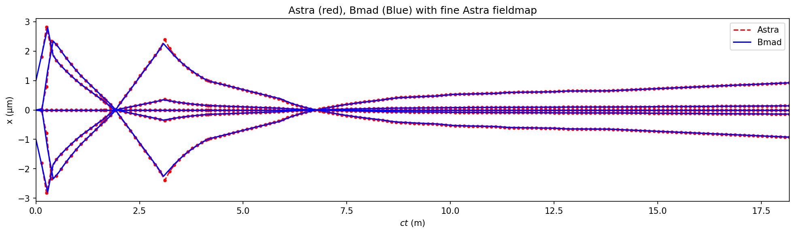

# `sc_inj` fieldmap model

These notebooks help build the fieldmap model for the superconducing injector (sc_inj) of LCLS: 

- [gunb fieldmaps](gunb_fieldmaps.ipynb)
- [Astra to Bmad settings](convert_from_astra.ipynb)

Tracking several tracer particles shows excellent agreement between the models:
