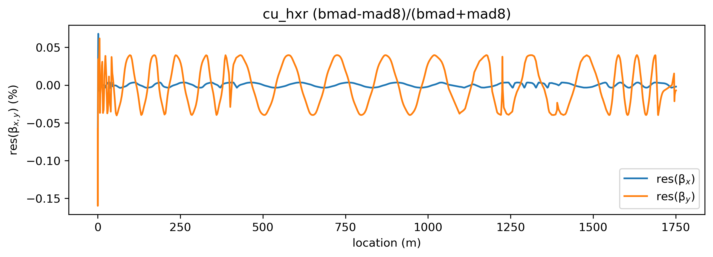
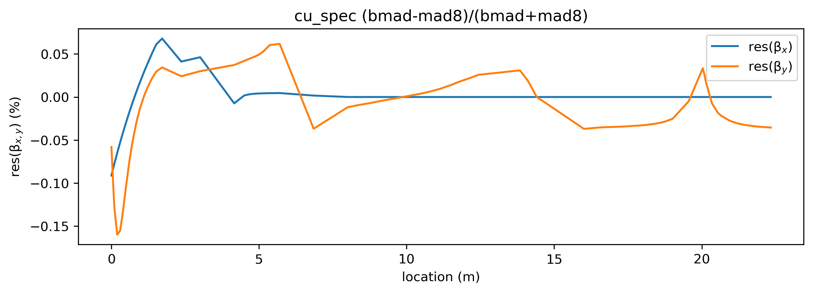
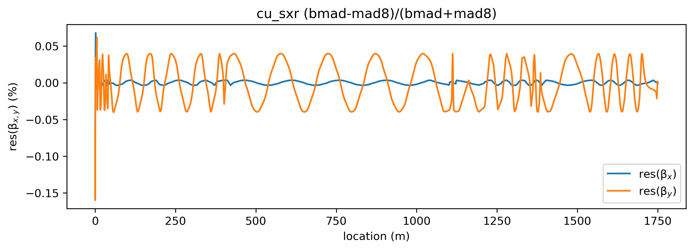
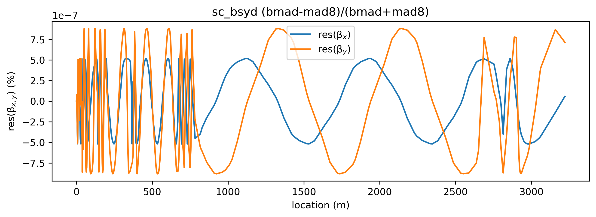
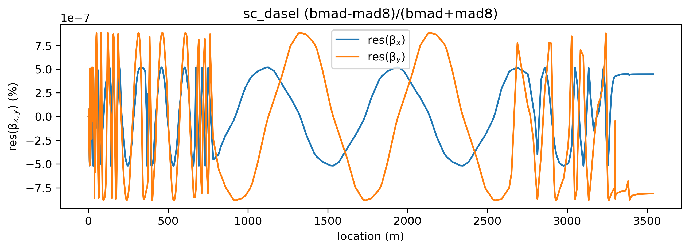
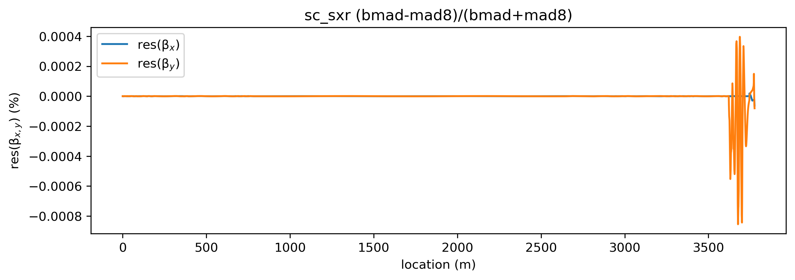
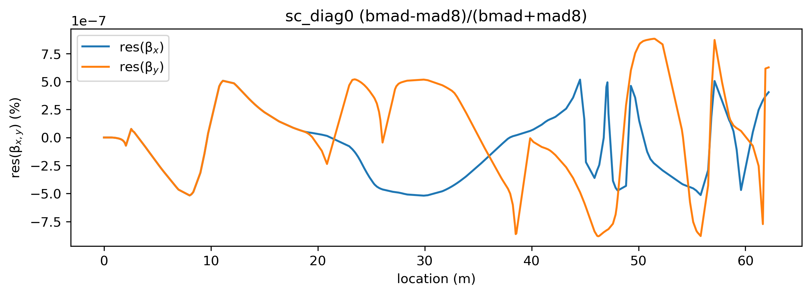

[Cu HXR](#cu-hxr)\
[Cu spec](#cu-spec)\
[Cu SXR](#cu-sxr)\
[SC BSYD](#sc-bsyd)\
[SC DASEL](#sc-dasel)\
[SC HXR](#sc-hxr)\
[SC SXR](#sc-sxr)\
[SC DIAG0](#sc-diag0)

# Cu HXR

# Cu spec

# Cu SXR

# SC BSYD

# SC DASEL

# SC HXR

# SC SXR

# SC DIAG0

